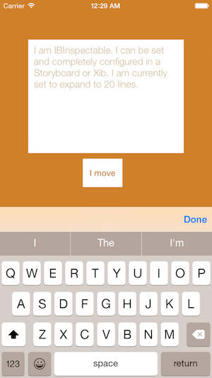
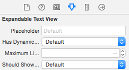
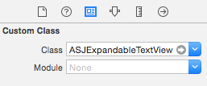

# ASJExpandableTextView

`UITextView`'s most obvious omission is the ability to set placeholder text. This class fixes that and provides more. You can make the text view expand and contract according to its content and have a "Done" button over the keyboard to hide it.



# Installation

CocoaPods is the preferred way to install this library. Add this command to your `Podfile`:

```
pod 'ASJExpandableTextView'
```

# Usage

Creating an `ASJExpandableTextView` is easy. It has a simple interface consisting of four properties which are `IBInspectable`. This means that they can be set using the interface builder of your choice; xibs or storyboards.

```objc
@property (nullable, copy, nonatomic) IBInspectable NSString *placeholder;
```
Sets the placeholder. Visible when there is nothing typed in the text view.

```objc
@property (nullable, strong, nonatomic) IBInspectable UIColor *placeholderTextColor;
```
Sets the placeholder text color. Will work only when the placeholder is visible.

```objc
@property (assign, nonatomic) IBInspectable BOOL isExpandable;
```
Set this to make the text view expand and contract according to its content.

```objc
@property (assign, nonatomic) IBInspectable NSUInteger maximumLineCount;
```
You can set the number of visible lines of the text view. Default is 4. To use this property, `isExpandable` must be set to `YES`.

```objc
@property (assign, nonatomic) IBInspectable BOOL shouldShowDoneButtonOverKeyboard;
```
The "return" key on the keyboard for a `UITextView` brings a new line, unlike a `UITextField` where the keyboard gets hidden. Set this property to show a "Done" button over the keyboard which can hide the keyboard.

```objc
@property (nullable, copy) DoneTappedBlock doneTappedBlock;
```
You can handle the event of the keyboard getting hidden using this block. To use this property, `shouldShowDoneButtonOverKeyboard` must be set to `YES`.



You can create one using just the interface builder, drop in a `UITextView` and change the class to `ASJExpandableTextView`.



# Credits

- To [Abhijit Kayande](https://github.com/Abhijit-Kayande) for fixing the choppy animation.
- To [devxoul](https://github.com/devxoul/UITextView-Placeholder) for placeholder label position fix.

# License

`ASJExpandableTextView` is available under the MIT license. See the LICENSE file for more info.
